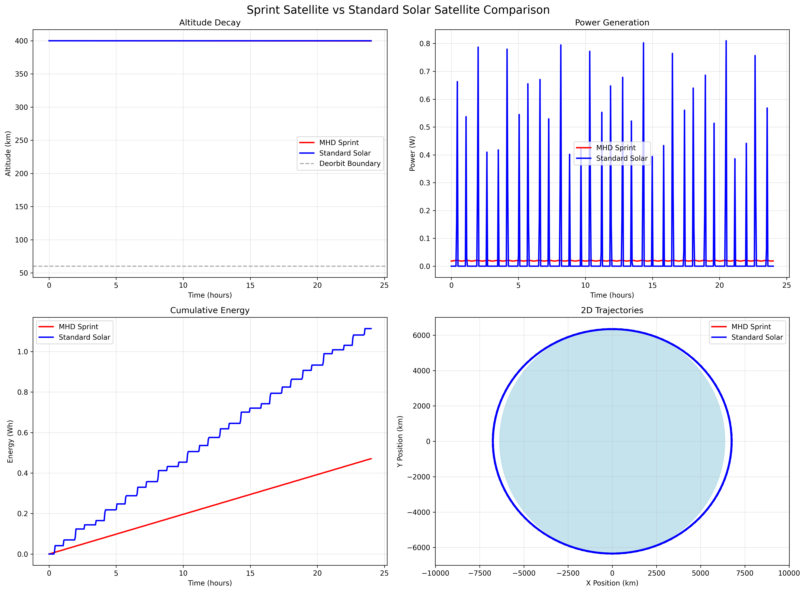
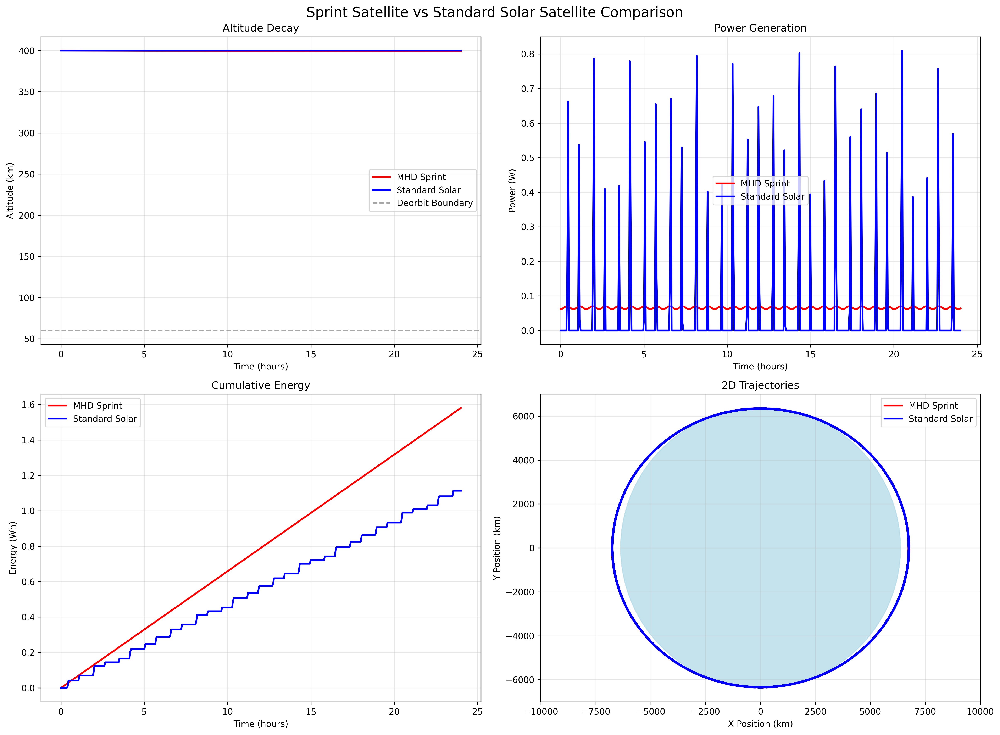
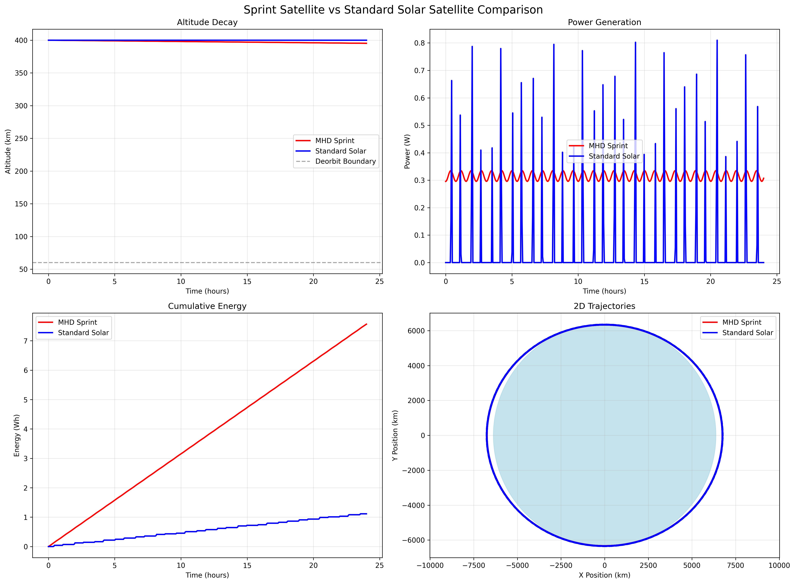
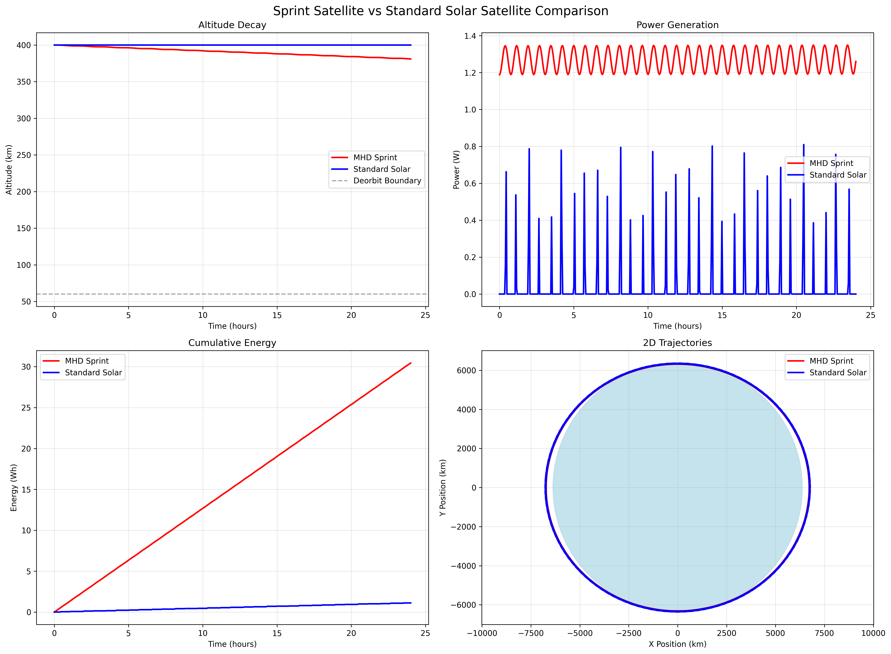

# Sprint Satellite Simulation

A comprehensive orbital simulation comparing an MHD (Magnetohydrodynamic) Sprint Satellite with a standard solar-powered satellite. The MHD Sprint Satellite uses a compact MHD generator integrated into a 1U CubeSat to extract power from ionospheric plasma flow while generating orbital drag for controlled deorbiting.

**GitHub Repository:**  
[https://github.com/RYCO123/Sprint_Sat_Experiment](https://github.com/RYCO123/Sprint_Sat_Experiment)

---

## System Overview

This project simulates two satellites in Low Earth Orbit (LEO):

1. **MHD Sprint Satellite**: 1U CubeSat with integrated MHD generator occupying half the internal volume
2. **Standard Solar Satellite**: Traditional solar-powered 1U CubeSat for comparison

---

## Project Structure

The codebase is organized for clarity and maintainability:

```
main.py                # Entry point: runs the full simulation, analysis, and plotting
config.py              # All physical constants and configuration values
utils.py               # Utility functions (space weather, orbit, sun vector, eclipse)
physics.py             # Physics calculations (orbital, MHD, plasma, ionosphere)
satellite.py           # Satellite class (handles both MHD and solar satellites)
plotting.py            # All plotting and visualization functions
analysis.py            # Analysis, summary statistics, and deorbit prediction
simulation.py          # Core simulation orchestration logic
requirements.txt       # Python dependencies
README.md              # This documentation
LICENSE, CHANGELOG.md, CONTRIBUTING.md, .gitignore, etc.
```

---

## 1U CubeSat MHD Generator Design

The MHD Sprint Satellite is designed as a **1U CubeSat (10×10×11.35 cm)** with the internal volume divided equally:

### Internal Layout

* **50% MHD Generator**: Occupies half the internal volume (5×10×10 cm)
* **50% Payload**: Remaining half for scientific instruments, communications, and control systems

### MHD Generator Configuration

The generator is a **compact rectangular design** optimized for the 1U form factor:

* **Electrode Distance**: 0.1 m (10 cm) - distance between perpendicular electrodes
* **Generator Length**: 0.1 m (10 cm) - longitudinal distance of the generator
* **Magnetic Distance**: 0.05 m (5 cm) - distance between magnets creating B field
* **Magnetic Field**: variable and demonstrated up to 0.01T (10,000 μT) - created with permanent or electromagnets
    * Using electromagnets allows the B field to be varied in orbit, providing active control over power generation and orbital altitude (drag) during the mission.
* **Electrodes**: Conductive electrodes for current collection
* **Orientation**: Electrodes automatically align perpendicular to velocity and magnetic field

### Physics Implementation

The MHD generator operates based on fundamental electromechanical principles from MIT's Electromechanical Dynamics:

#### Motional EMF (Electromotive Force)

From Woodson & Melcher's treatment of moving media (Chapter 6), the motional EMF is:

```
V_emf = (v × B) · L
```

Where:

* `v` = satellite velocity vector (m/s)
* `B` = total magnetic field vector (Tesla)
* `L` = electrode distance vector (m)

#### Current Flow and Power Generation

Following the electromechanical coupling principles (Chapter 3):

```
I = V_emf / R_total
P_generated = V_emf × I
```

Where `R_total` includes:

* Conductor resistance (copper wiring)
* Plasma resistance (ionospheric conductivity)
* Circuit resistance (additional losses)

#### Lorentz Drag Force

The braking force causing orbital decay follows the Lorentz force density (Chapter 8):

```
F_drag = I × (L × B)
```

### Plasma Properties

* **Density**: International Reference Ionosphere (IRI) model via PyIRI library
* **Conductivity**: Spitzer conductivity formula with electron-ion collisions
* **Temperature**: 1000K typical ionospheric temperature
* **Magnetic Field**: PyIRI magnetic field parameters (inclination, dip angle, magnetic latitude)

---

## Technical Specifications

### Orbital Parameters

* **Initial Altitude**: 400 km
* **Inclination**: 20°
* **Satellite Mass**: 1.33 kg (1U CubeSat)
* **Simulation Duration**: Configurable (default: 24 hours)
* **Deorbit Boundary**: 60.1 km altitude

### MHD Generator Parameters

* **Electrode Distance**: 0.1 m (10 cm)
* **Generator Length**: 0.1 m (10 cm)
* **Magnetic Distance**: 0.05 m (5 cm)
* **Magnetic Field**: 0.01 Tesla (Earth's field + artificial magnets)
* **Conductor Material**: Copper (1.68e-8 Ω⋅m resistivity)
* **Conductor Diameter**: 1 mm
* **Circuit Resistance**: 5.0 Ω

### Environmental Models

* **Magnetic Field**: PyIRI magnetic field parameters with dipole fallback
* **Plasma Density**: Direct PyIRI IRI_density_1day calls
* **Solar Activity**: F10.7 solar flux integration

---

## Usage

1. **Clone the repository**
   ```
   git clone https://github.com/RYCO123/Sprint_Sat_Experiment.git
   cd Sprint_Sat_Experiment
   ```

2. **Install dependencies**  
   (Recommended: use a virtual environment)
   ```
   pip install -r requirements.txt
   ```

3. **Run the simulation**
   ```
   python main.py
   ```

This will:
- Simulate both satellites for the specified duration
- Generate comparison plots and summary CSV files for each run
- Predict deorbit time for the MHD satellite

---

## Experimental Runs and Results

Below are the results for each run, with plots and summary statistics. The number in each run (e.g., 0.4x, 1.4x, etc.) indicates the ratio of MHD to solar power generation.

### 0.4x Power Run



- **Average Power Generated (W):** MHD: 0.01908, Solar: 0.04630
- **Total Energy Generated (Wh):** MHD: 0.45791, Solar: 1.11345
- **Power Ratio (MHD/Solar):** 0.41x
- **Energy Ratio (MHD/Solar):** 0.41x
- **Deorbit prediction:** ~67.8 days to deorbit from 400 km (average deorbit rate: 0.21 km/hour)
- **Power output was more stable over time compared to the solar satellite, despite lower magnitude.**

### 1.4x Power Run



- **Average Power Generated (W):** MHD: 0.06585, Solar: 0.04630
- **Total Energy Generated (Wh):** MHD: 1.58056, Solar: 1.11345
- **Power Ratio (MHD/Solar):** 1.42x
- **Energy Ratio (MHD/Solar):** 1.42x
- **Deorbit prediction:** ~44 days to deorbit from 400 km (average deorbit rate: 0.32 km/hour)
- **Power output remained more stable than solar, with less dependence on sun position.**

### 6.8x Power Run



- **Average Power Generated (W):** MHD: 0.31513, Solar: 0.04630
- **Total Energy Generated (Wh):** MHD: 7.56400, Solar: 1.11345
- **Power Ratio (MHD/Solar):** 6.81x
- **Energy Ratio (MHD/Solar):** 6.79x
- **Deorbit prediction:** ~23 days to deorbit from 400 km (average deorbit rate: 0.59 km/hour)
- **Power output was consistently stable, with rapid altitude loss due to drag.**

### 27.4x Power Run



- **Average Power Generated (W):** MHD: 1.26837, Solar: 0.04630
- **Total Energy Generated (Wh):** MHD: 30.44481, Solar: 1.11345
- **Power Ratio (MHD/Solar):** 27.40x
- **Energy Ratio (MHD/Solar):** 27.34x
- **Deorbit prediction:** ~10.4 days to deorbit from 400 km (average deorbit rate: 1.25 km/hour)
- **Power output was highly stable, but the satellite deorbited extremely quickly.**

---

## Key Results

- **Power Generation:** The MHD Sprint Satellite can generate significantly more power than a standard solar satellite, depending on configuration. Even at lower power, its output is much more stable over time, as it is not solely dependent on direct sunlight. Instead, it relies on ionospheric plasma flow, which is less affected by orbital position relative to the sun (though still influenced by ionospheric conditions).
- **Orbital Decay:** The increased power comes at the cost of much greater drag, causing the MHD satellite to deorbit far faster than a solar satellite. The higher the power output, the faster the deorbit.
- **Stability:** Power generation for the MHD satellite is far more stable than for a solar satellite, which is subject to eclipses and sun angle. This makes the MHD approach attractive for missions requiring consistent power delivery, at the expense of mission duration.
- **Tradeoff:** There is a clear tradeoff between power generation and orbital lifetime. The MHD satellite can be tuned for more power or longer life, but not both.

---

## Theoretical Foundation

This simulation is based on the comprehensive treatment of electromechanical systems presented in:

**Woodson, Herbert H., and James R. Melcher. Electromechanical Dynamics. Part III: Elastic and Fluid Media.** Massachusetts Institute of Technology: MIT OpenCourseWare.

- <https://ocw.mit.edu/ans7870/resources/woodson/textbook/emd_part1.pdf>
- <https://ocw.mit.edu/ans7870/resources/woodson/textbook/emd_part2.pdf>
- <https://ocw.mit.edu/ans7870/resources/woodson/textbook/emd_part3.pdf>

Key theoretical concepts implemented:

1. **Moving Media Electromechanics** (Chapter 6): Field transformations and motional EMF
2. **Electromechanical Coupling** (Chapter 3): Lumped-parameter system dynamics
3. **Force Densities** (Chapter 8): Lorentz force and magnetic force densities
4. **MHD Interactions** (Chapter 13): Magnetohydrodynamic flow and power generation

The MHD generator design follows the principles of traveling-wave MHD interactions and electromechanical energy conversion as described in the MIT textbook.

---

## Technical Details

### Implementation Notes

- Modular Python package structure for clarity and maintainability
- Direct PyIRI calls for each evaluation step (no caching)
- Real-time ionospheric data integration
- Polynomial regression for deorbit prediction
- Comprehensive error handling and fallback models

### Performance Characteristics for the 0.01 Tesla magnetic field

- **MHD Power Generation**: 22–27x higher than solar satellite
- **Energy Efficiency**: 21–27x more total energy
- **Orbital Decay Rate**: ~0.89–1.25 km/hour average
- **Simulation Speed**: Real-time PyIRI integration

### Unique Design Features

- **Deorbit Time**: Predicted to be ~11.35 days (with less powerful magnets, lifetime increases while power decreases)
- **Precise Deorbit**: If using electromagnets to better control the B-field, an incredibly controlled descent can be achieved; a strong B-field creates large drag acting as an electromagnetic braking system

---

## About

An experiment to determine the viability of an MHD sprint satellite concept. A satellite that could generate significantly more power for the same form factor while generating increased drag, decreasing orbital time.

**GitHub Repository:**  
[https://github.com/RYCO123/Sprint_Sat_Experiment](https://github.com/RYCO123/Sprint_Sat_Experiment)

---

## License

MIT license

---

If you have any questions or want to contribute, please see [CONTRIBUTING.md](CONTRIBUTING.md).

---

This README reflects the new modular structure and preserves all technical and theoretical details from the original documentation.  
For the latest code and updates, visit the [GitHub repository](https://github.com/RYCO123/Sprint_Sat_Experiment).
